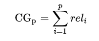
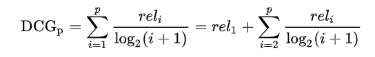
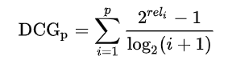
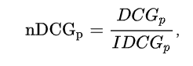
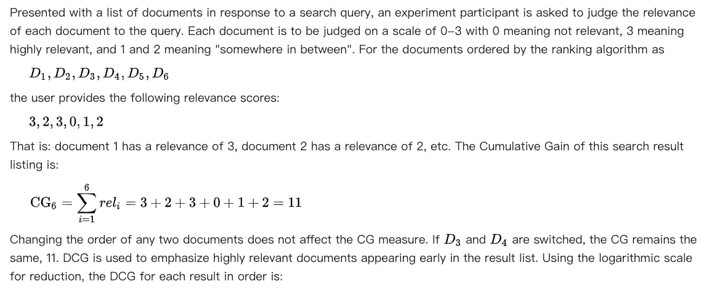
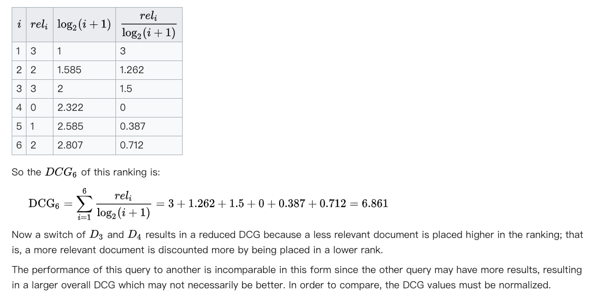
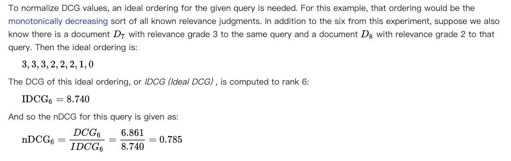

[learning to rank](https://en.wikipedia.org/wiki/Learning_to_rank)

[Discounted cumulative gain](https://en.wikipedia.org/wiki/Discounted_cumulative_gain)

## 评测测度

最常用：CG, DCG and NDCG

### 文档相关性

首先需要定义graded relevance of a document，就是文档相关性

1. 最简单的定义方式如下：

真正（理想）的结果中，假设top n的集合是{a_1, a_2, ..., a_n}

实际搜索得到的top n的结果中，如果document_i属于以上的集合，那么这个文档的graded relevance就是rel_i=1, 否则的话，rel_i=0.

2. 还有一种定义方式:

假设搜索得到6篇文档，由用户给搜索相关性打分，分别为：3,2,3,0,1,2

3表示和搜索的词最相关，0表示完全不相关，1和2介于二者之间。

### 具体评测

1. CG: Cumulative Gain，累积增益

rel_i是排序结果中第i个位置的相关性得分。可以看到CG不受排序顺序的影响，即使改变排序顺序，CG值不变。

2. DCG: Discounted Cumulative Gain

这个公式的特点是，如果相关性得分较高的文档出现在排序结果中靠后的位置，整体得分会受到惩罚，导致总的得分下降。所以，DCG得分受排序顺序的影响。

在工业界和Kaggle等数据科学比赛中，更常用的DCG公式是下面这个：

这个公式把相关性得分放在了指数上，更加强调相关性得分的影响。

3. NDCG: Normalized DCG

总的思想是用理想结果作为分母，把DCG的值进行normalize，这样的话，即使搜索的是不同的词，NDCG也可以用来比较。

公式如下：

其中，IDCG是理想情况下的排序结果的DCG值。

### 例子

